# DASHBOARD | INSIDE ADMIN

# Admin account to test
 - minhChuong@gmail.com
 - mk: 123456

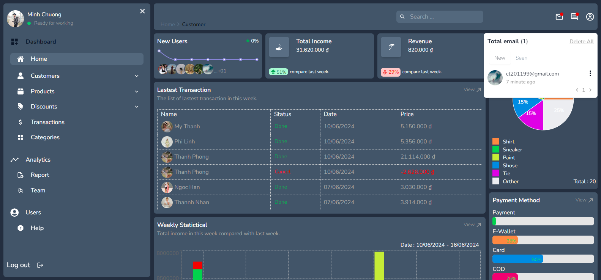

## Description
<p>Dashboard | Inside is the admin page to manage your E-commecial page, like magage user, add new product, manage your customer's order, create discount, solve the customer's problem</p>
 
## Tech Stack
  - **Front-End**:ReactJS, NextJS 14, NextAuth, Zod, TailWind, Cloudinary, Prisma, TypeScript,...
  - **Database**:PostGreSQL

## Feature
1. **Page Detail**
    -  SignIn with Google, Github / Email 
    -  Home Page : Show overwiew about the page
    -  Customer Page: Manage customer, create, delete, update customer.
    -  Product Page: Manage product, create, delete, update product.
    -  Discount Page: Manage discount, create, delete, update discount.
    -  Transaction Page: Manage Transaction, change order's status.
    -  Report Page: See and Manage customer's report 
    -  Team Page: See and Manage Admin's account, permission
    -  Comment page: Comment
    -  Contact Us Page: contact with owner, admin.
    -  History Page: save action in dashboard and automatic deleted after.


## Demo
- Dashboard | Inside Admin Demo : 
[[https://dashboard-admin-dun.vercel.app]](https://dashboard-admin-dun.vercel.app/signIn)
- Video Demo on Youtube : 
[Dashboard | Inside Admin demo video](https://youtu.be/IMYshe-oIm0?si=qQehXEyb8XUvNG-1)

## ScreenShots

 # Desktop
  # Home Page

  

  # SignIn & Forget Password Page

   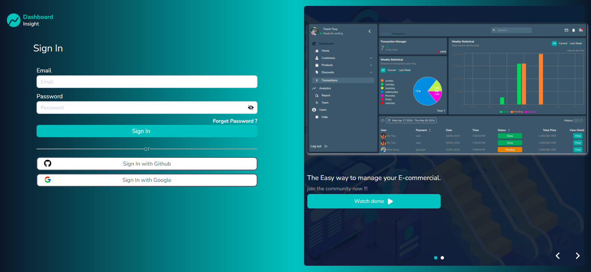
   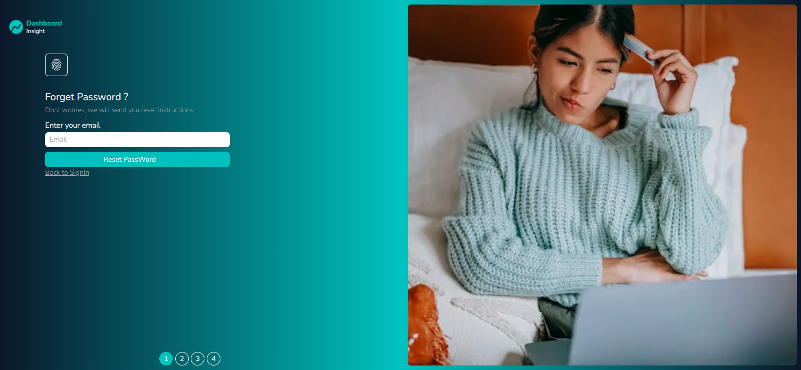
   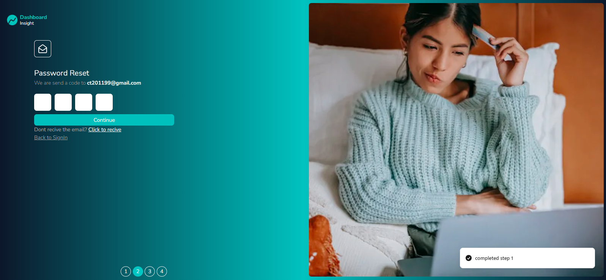

   # Customer Page

   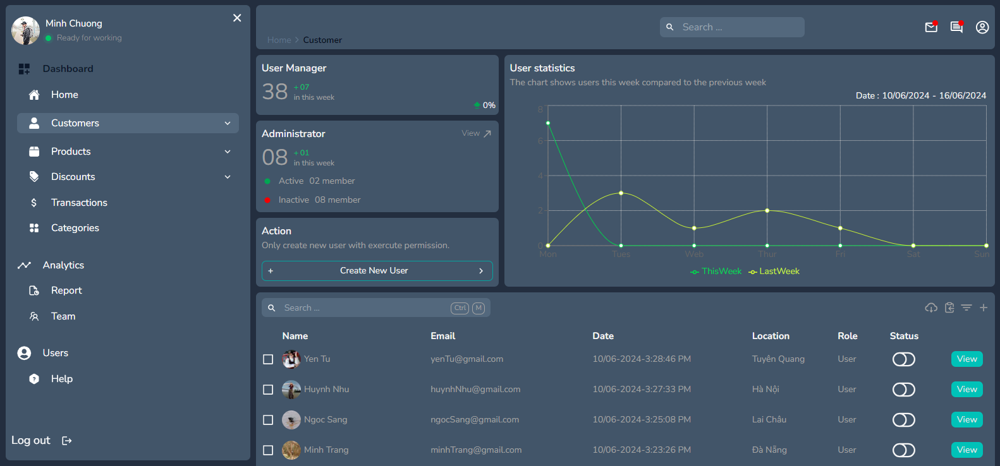

 # Product Page

  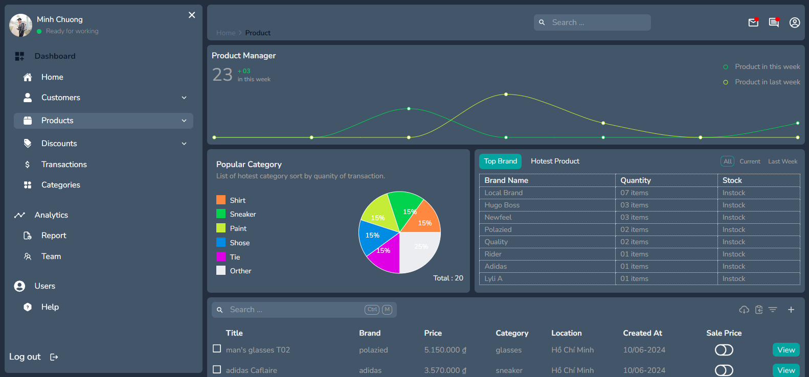
  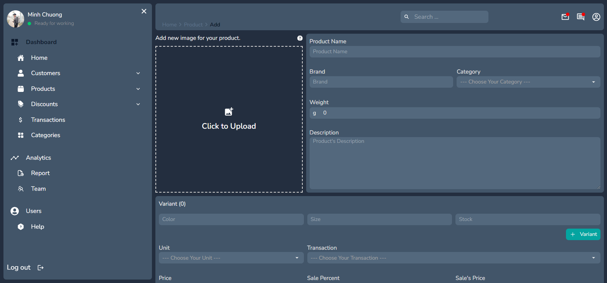
  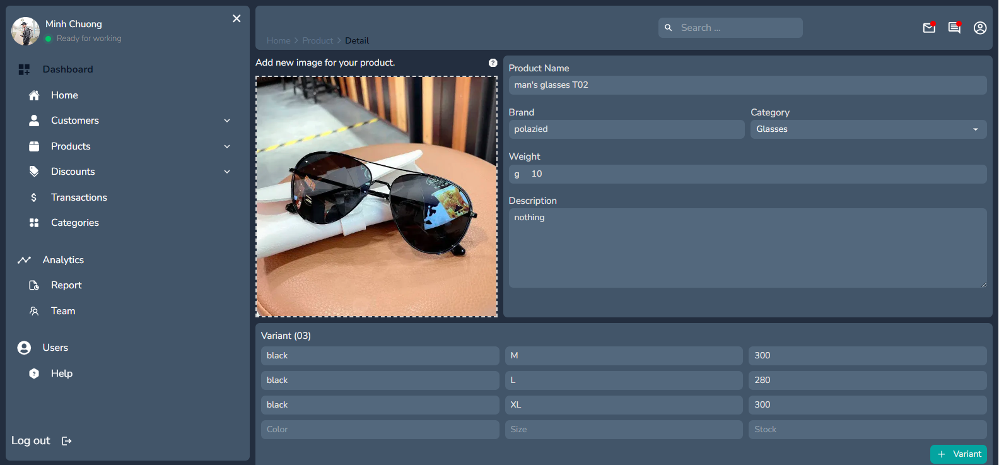

 # Team Page

  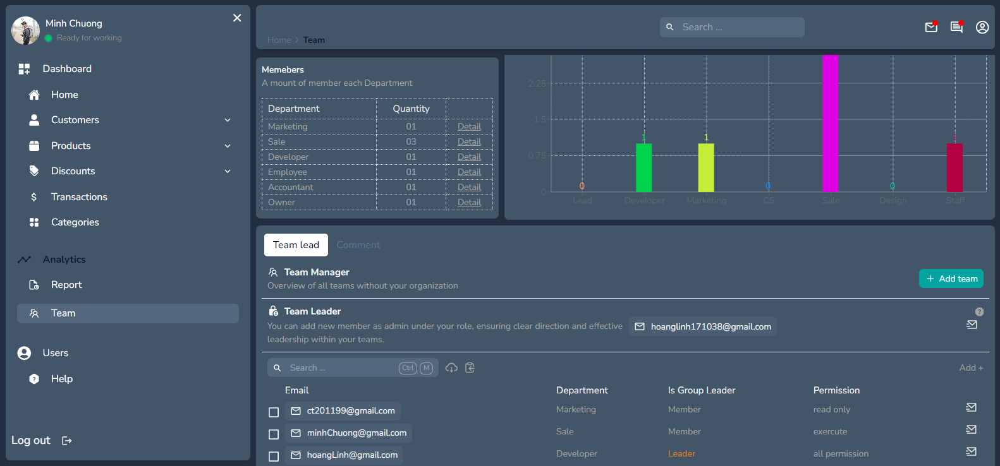
  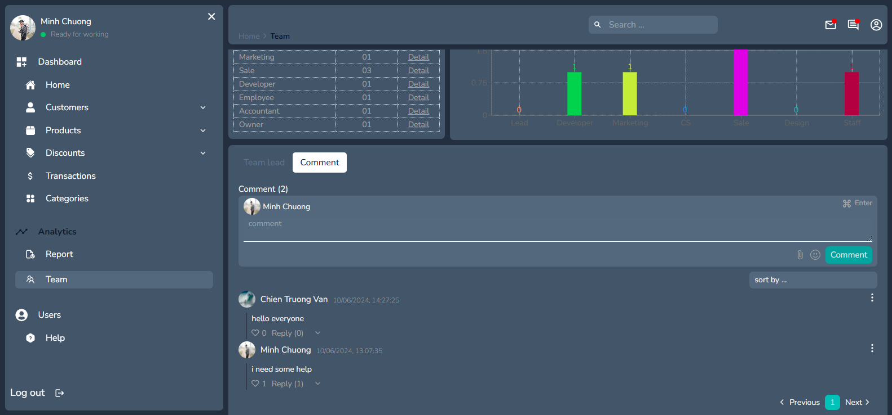
  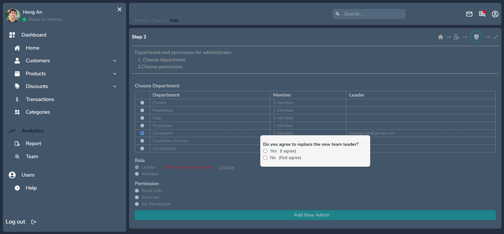

# Transaction Page

  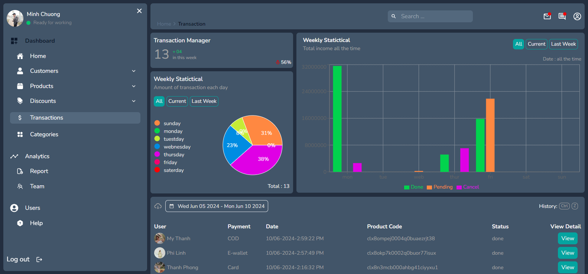

## Author
 - [Linh Thái](https://www.facebook.com/Linh201199)

## Run Locally
Clone the project

```bash
  git clone https://github.com/hlinh171038/dashboard-admin
```
Go to project direction

```bash
  cd my-project
```

Install depedencies

```bash
  npm install
```

Start the server

```bash
  npm run dev
```
Generate prisma

```bash
  npx prisma generate
```

```bash
  npx prisma db push
```

Prisma  Stuido
```bash
  npx prisma studio
```

### Deloyment
To run this project, you must link your github repo to [vercel](https://vercel.com/).

### Feedback
If you have any feedback, please reach out to us at hoanglinh171038@gmail.com

